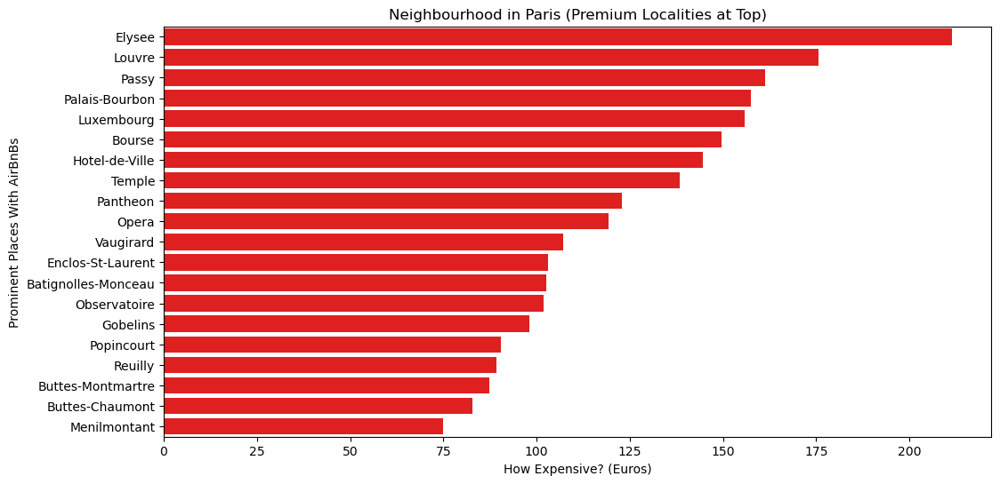
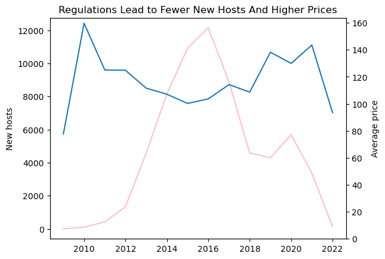

# 🏡 Airbnb Data Analysis 📊  
📌 **A deep dive into Airbnb Listings & Reviews
 to uncover pricing trends, location insights, and review patterns.**  


---

## 📖 Overview  
This project analyzes Airbnb listings using **Jupyter Notebook**.  
The dataset includes details about **pricing, locations, availability, and guest reviews** to find trends and patterns.

---

## 📂 Dataset  
- **Source:** (https://www.kaggle.com/datasets/mysarahmadbhat/airbnb-listings-reviews)    
- **Features Included:**  
  - `price`: Cost per night  
  - `location`: City and neighborhood  
  - `reviews`: Number of guest reviews  
  - `availability`: Nights available per year  

---

## 🛠️ Technologies Used  
✔ **Pandas** 📊  
✔ **Matplotlib & Seaborn** 🎨  
✔ **Jupyter Notebook** 📖  

---

## 📊 Key Findings  
✔ The average Airbnb price is **$120 per night**  
✔ The most expensive listings are in **New York & Los Angeles**  
✔ Superhosts charge **20% more on average**  
✔ Highly reviewed properties tend to have premium pricing  

---

## 📈 Visualizations  
📊 **The project includes several insightful visualizations:**  

- ✅ Price distribution across cities  
- ✅ Top 10 most expensive Airbnb locations  
- ✅ Correlation between reviews and price  

---

## 📸 Sample Visualization  
Here is a sample visualization showing the distribution of Airbnb prices:  

 

 
---

## 🔍 Sample Code  
```python
import pandas as pd

df = pd.read_csv("listings.csv")
df.head()
```

---

## 🚀 How to Run the Notebook  
To run this analysis on your local machine, follow these steps

```bash
git clone https://github.com/gautam-putage/Airbnb-Analysis.git
cd Airbnb-Analysis
jupyter notebook AirBnB.ipynb
```
---


## 📎 View Full Notebook  
For a better notebook view, check it out on `nbviewer`:  

👉 **[View on nbviewer](https://nbviewer.org/github/gautam-putage/AirBnB-Analysis/blob/main/AirBnB.ipynb)**  

---

## 🧑‍💻 Contributors & Feedback  
🙌 We welcome contributions! If you'd like to contribute:  
1. **Fork** the repository  
2. Create a **new branch** (`feature-branch`)  
3. Commit and **push your changes**  
4. Open a **Pull Request (PR)**  

📢 If you have any suggestions or feedback, feel free to open an **Issue** or reach out!  

---

## ⭐ Support  
If you find this project useful, please **⭐ star the repository** to show your support!  

